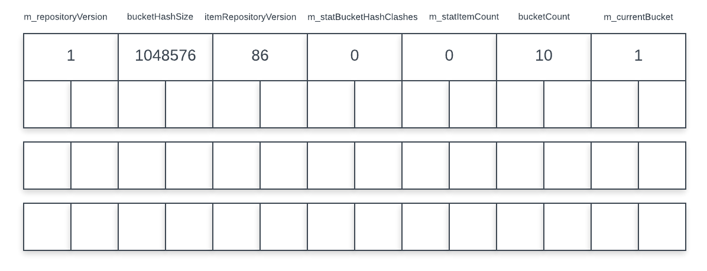
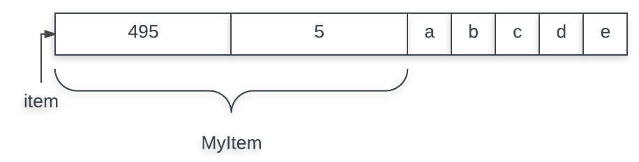
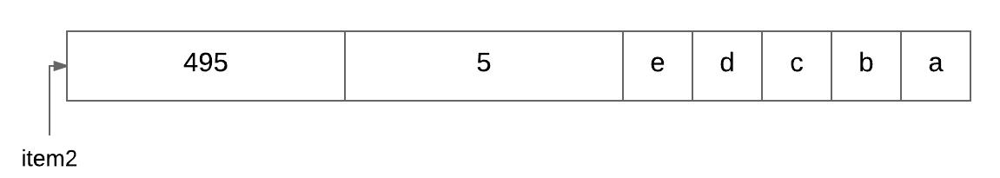

#### __Initial Values for ItemRepository__

```cpp
m_repositoryName = name provided
m_registry = global item repository registery
m_file = absolute path to file (Testing in this case)
m_dynamicFile = absolute path to file (Testing_dynamic in this case)
m_repositoryVersion = 86
m_manager = AbstractRepositoryManager provided ( nullptr default )
m_unloadingEnabled = true
m_metaDataChanged = true
m_buckets = QVector(20,nullptr)
m_statBucketHashClashes = 0
m_statItemCount = 0
m_currentBucket = 1
m_firstBucketForHash = array of short unsigned of size bucketHashSize filled with 0
```

#### __Initial Values for Bucket__

```cpp

enum {
	AdditionalSpacePerItem = 2
    };
enum {
	ObjectMapSize = ((ItemRepositoryBucketSize / ItemRequest::AverageSize) * 3) / 2 + 1,
	MaxFreeItemsForHide = 0, //When less than this count of free items in one buckets is reached, the bucket is removed from the global list of buckets with free items
	MaxFreeSizeForHide = fixedItemSize ? fixedItemSize : 0, //Only when the largest free size is smaller then this, the bucket is taken from the free list
	MinFreeItemsForReuse = 10,//When this count of free items in one bucket is reached, consider re-assigning them to new requests
	MinFreeSizeForReuse = ItemRepositoryBucketSize/20 //When the largest free item is bigger then this, the bucket is automatically added to the free list
};
enum {
	NextBucketHashSize = ObjectMapSize, //Affects the average count of bucket-chains that need to be walked in ItemRepository::index. Must be a multiple of ObjectMapSize
	//				(m_dirty) + (m_monsterBucketExtent,m_available,m_freeItemCount) + itemrepository + (m_objectMap,m_nextBucketHash,m_largestFreeItem)
	DataSize = sizeof(char) + sizeof(unsigned int) * 3 + ItemRepositoryBucketSize + sizeof(short unsigned int) * (ObjectMapSize + NextBucketHashSize + 1)
};
enum {
	CheckStart = 0xff00ff1,
	CheckEnd = 0xfafcfb
};

m_monsterBucketExtent = 0
m_available = 0
m_data = nullptr
m_mappedData = nullptr
m_objectMap = nullptr
m_largestFreeItem = 0
m_freeItemCount = 0
m_nextBucketHash = nullptr
m_dirty = false
m_changed = false
m_lastUsed = 0

```


#### __Example of an Item__

```cpp

// hash function for the item is copy of ascii values of each character
// let MyItemRequest::AverageSize = sizeof(MyItem) = 8

class MyItem
{
public:
	unsigned int itemsize()
	{
		return m_itemsize + sizeof(this);
	}

	unsigned int hash()
	{
		return m_hash;
	}

	bool equals(const TestItem* rhs) const
	{
		return rhs->m_hash == m_hash
			&& itemSize() == rhs->itemSize()
			&& memcmp((char*)this, rhs, itemSize()) == 0;
	}

private:
	unsigned int m_hash;
	unsigned int m_itemsize;
};
```

#### __Creating a Reposiroty__

```cpp
/*
 * this will create and register ItemRepository in ~/.cache/kdevduchain/kdev_session_folder/
 * Two Files will be created Testing and Testing_dynamic
 */

KDevelop::ItemRepository<MyItem,MyItemRequest> repository ("Testing");
```

after above code contents of the Testing file is



after creating new repository
```cpp
m_fileMapSize = 0;
m_fileMap = nullptr;
```

#### __Case 1__ : Saving MyItem in a Repository



```cpp
MyItem *item = createItem("abcde");
MyRequestItem mri(*item);

// this will save the item in the repository

repository.index(mri);
repository.store();

```

> Contents of File Testing after storing in repository


#### __Case 2__ : Saving another MyItem with same hash




> Contents of File Testing after storing item above


#### __Case 3__ : Saving another MyItem with same hash if bucket only have 2 Bytes Left


